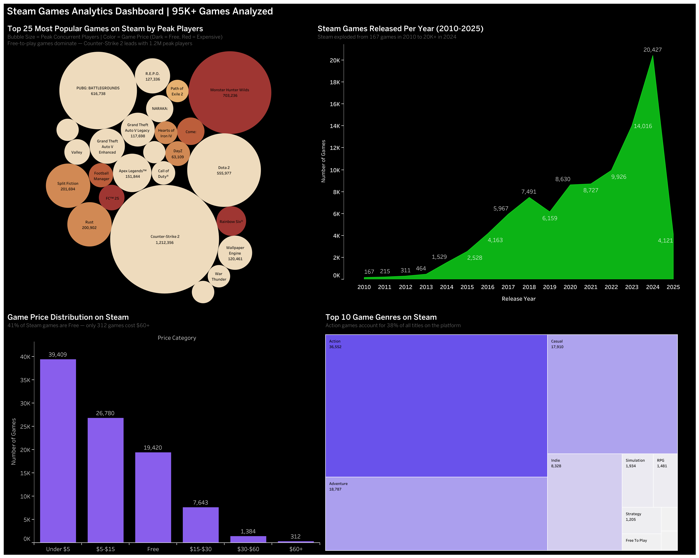

# Steam Games Analytics Dashboard

An interactive Tableau dashboard analyzing **95,000+ games** on the Steam platform, uncovering insights about pricing strategies, genre dominance, player engagement, and market growth trends.

## Live Dashboard

[View the Interactive Dashboard on Tableau Public](https://public.tableau.com/app/profile/priyanka.kanojia1211/viz/SteamGamesAnalyticsDashboard95KGamesAnalyzed/)

## Key Insights

| Insight | Finding |
|---------|---------|
| Total Games Analyzed | **94,948** |
| Most Popular Game | **Counter-Strike 2** (1.2M peak concurrent players) |
| Dominant Genre | **Action** (36,552 games — 38% of platform) |
| Free Games | **39,409** (41% of all games are free) |
| Market Growth | **122x increase** from 167 games in 2010 to 20,427 in 2024 |
| Average Price | **$6.68** — prices have decreased as supply exploded |

## Dashboard Preview

### Full Dashboard


### Individual Visualizations

**Top 25 Games by Peak Players (Bubble Chart)**
- Bubble size represents peak concurrent players
- Color gradient shows game price (dark = free, red = expensive)
- Free-to-play games dominate the top — Counter-Strike 2, Dota 2, and Team Fortress 2 are all free

**Steam Games Released Per Year (Area Chart)**
- Explosive growth from 167 games in 2010 to 20,427 in 2024
- The indie game revolution began around 2014-2015
- 2025 data is partial (only Q1)

**Game Price Distribution**
- 41% of Steam games are completely free
- 28% are priced under $5
- Only 312 games (0.3%) cost $60+

**Genre Distribution (Treemap)**
- Action games dominate with 38% market share
- Adventure and Casual follow as the next largest categories
- Niche genres like Racing and Free To Play occupy small but dedicated segments

## Tech Stack

| Tool | Purpose |
|------|---------|
| **Python** | Data cleaning, transformation, and ETL pipeline |
| **Pandas** | Data manipulation and analysis |
| **SQL (SQLite)** | Data querying and analytical insights |
| **Tableau Public** | Interactive dashboard visualization |
| **Jupyter Notebook** | Development environment |

## Project Architecture

```
steam-games-analytics-dashboard/
├── Steam_Games_Analysis.ipynb     # Jupyter notebook with full analysis
├── steam_tableau_ready.csv        # Cleaned dataset for Tableau
├── steam_games_cleaned.csv        # Intermediate cleaned dataset
├── steam_games.db                 # SQLite database
├── dashboard_preview.png          # Dashboard screenshot
└── README.md
```

## Data Pipeline

1. **Data Ingestion** — Loaded 471MB raw dataset (94,948 games, 47 columns) from Kaggle's Steam Games Dataset 2025
2. **Data Cleaning** — Removed duplicates, parsed dates, extracted primary genres/publishers/developers from nested fields
3. **Feature Engineering** — Created price categories, release year/month, primary genre/publisher columns
4. **SQL Analysis** — Built 10 analytical queries covering trends, rankings, comparisons, and distributions
5. **Visualization** — Designed interactive Tableau dashboard with 4 complementary chart types

## SQL Queries Performed

1. Games released by year (2010-2025)
2. Top 10 genres by game count
3. Price category distribution
4. Top 10 most reviewed games
5. Free vs paid games comparison
6. Top 10 publishers by game count
7. Top 10 games by peak concurrent players
8. Average price by genre
9. Platform support analysis (Windows/Mac/Linux)
10. Highest rated games (10K+ reviews)

## Business Insights & Recommendations

**For Game Developers:**
- The market is increasingly crowded — 20K+ games released in 2024 alone
- Free-to-play with in-game monetization is the dominant pricing strategy
- Action genre is oversaturated — niche genres may offer better visibility

**For Platform Analysts:**
- Average game prices are declining year over year as supply increases
- Counter-Strike 2 and Dota 2 (both free) drive the highest player engagement
- The gap between top games and average games is widening significantly

**For Investors:**
- Steam's game catalog grew 122x in 14 years — platform growth is accelerating
- Free-to-play games generate engagement; premium games ($60+) represent only 0.3% of catalog
- The indie segment (under $15) represents the largest paid market opportunity

## Dataset

- **Source:** [Steam Games Dataset 2025 - Kaggle](https://www.kaggle.com/datasets/artermiloff/steam-games-dataset)
- **Size:** 471MB, 94,948 games, 47 features
- **Time Period:** Games released from 1997 to March 2025

## How to Run

```bash
# Clone the repository
git clone https://github.com/priyankakanojia36/steam-games-analytics-dashboard.git
cd steam-games-analytics-dashboard

# Create virtual environment
python3 -m venv venv
source venv/bin/activate

# Install dependencies
pip install pandas numpy sqlalchemy jupyter

# Run the notebook
jupyter notebook Steam_Games_Analysis.ipynb

# Open the Tableau dashboard
# Connect Tableau to steam_tableau_ready.csv
```

## Author

**Priyanka Kanojia**
- M.S. in Analytics, Northeastern University — College of Professional Studies
- [LinkedIn](https://www.linkedin.com/in/priyanka-kanojia-113192144/)
- [Tableau Public](https://public.tableau.com/app/profile/priyanka.kanojia1211)
- [GitHub](https://github.com/priyankakanojia36)
- [Email](mailto:kanojia.p@northeastern.edu)
